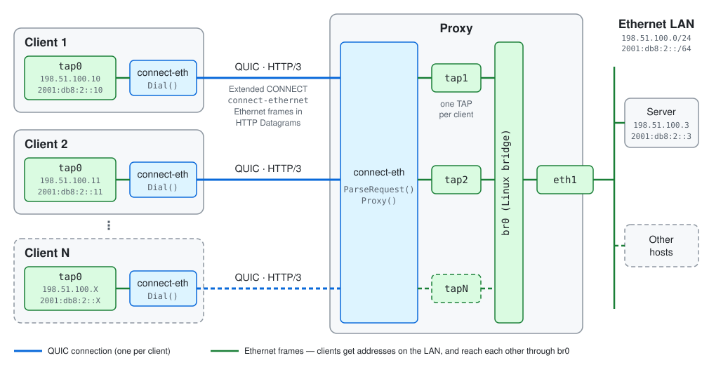

# Proxying Ethernet over HTTP

[*connect-eth-go*](https://github.com/DomenicoVerde/connect-eth-go) is an implementation of the 
[draft-ietf-masque-connect-ethernet](https://datatracker.ietf.org/doc/draft-ietf-masque-connect-ethernet/), 
allowing the proxying of Ethernet frames via QUIC and HTTP/3. It is currently updated to version 15 of the draft.

The project is entirely based on [quic-go](https://github.com/quic-go/quic-go), and provides both a client and 
a proxy implementation. Dockerized versions of client, proxy, and server are provided
under the [examples](examples) directory.

At this point, it supports the following use cases:
* Remote Access L2 VPN, see 
[Section 8.1](https://www.ietf.org/archive/id/draft-ietf-masque-connect-ethernet-15.html#section-8.1)
* Site-to-Site L2 VPN, see
[Section 8.2](https://www.ietf.org/archive/id/draft-ietf-masque-connect-ethernet-15.html#section-8.2)

VLANs are supported as well: IEEE 802.1Q tagged frames are transparently forwarded through the tunnel, see
[Section 9.2](https://www.ietf.org/archive/id/draft-ietf-masque-connect-ethernet-15.html#section-9.2).
To avoid loops, it is also recommended to enable the Spanning Tree Protocol (STP) on the bridged Ethernet segments.
Check captures under the [pcaps](pcaps) directory to verify compliance with the draft.

### Decrypting packet captures

[pcaps/keys.txt](pcaps/keys.txt) contains the TLS secrets of the QUIC connection captured in [pcaps](pcaps),
logged by the example client. To decrypt the captures in Wireshark, set it in
*Preferences → Protocols → TLS → (Pre)-Master-Secret log filename*.

## License

Distributed under the MIT License — see [LICENSE](LICENSE).

## Acknowledgements

This project is based in part on [connect-ip-go](https://github.com/quic-go/connect-ip-go) and [masque-go](https://github.com/quic-go/masque-go),
both licensed under the MIT License by [Marten Seemann](https://github.com/marten-seemann).
The original source code has been modified and adapted for this project.

## Contributing

Bug reports and pull requests are welcome.
